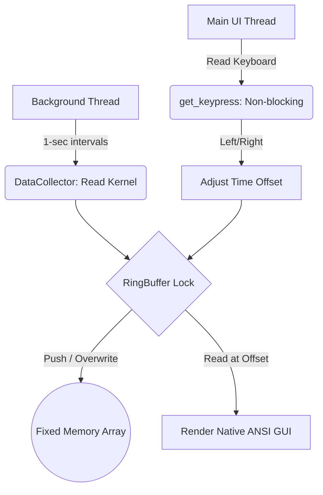

# ⏳ Time-Traveling Task Monitor

   

> A high-performance, cross-platform OS utility that buffers system metric snapshots into a memory-safe O(1) ring buffer, letting you instantly "rewind time" to diagnose historic performance spikes — built from scratch in Python with zero external GUI frameworks.

---

## Demo


---

## The Problem

Standard OS utilities like Windows Task Manager, Linux `top`, and `htop` are fundamentally blind to intermittent spikes.

- If your system hits 100% CPU for 2 seconds, by the time you open Task Manager, the offending process has already returned to normal or crashed out.
- You're left with no actionable data unless you log gigabytes of performance traces over hours.

**There is no built-in way to look back in time.**

---

## The Solution

Press the **Left Arrow Key** to instantly rewind and see exactly which process caused the spike, exactly when it happened — with zero performance overhead and zero disk writes.

---

## Architecture

Built on four concurrent pillars, specifically optimized for resource-constrained machines.

### 1. Data Collector (OS Metrics)
The `DataCollector` class uses `psutil` to interface directly with kernel data. On every tick it reads global CPU %, global RAM usage, iterates all active PIDs, tracks CPU deltas, and bundles the top 20 consuming processes into a `SystemSnapshot`.

### 2. O(1) Ring Buffer (Memory Safety)
A custom fixed-size `RingBuffer` pre-allocated at `[None] * 600` — 10 minutes of history. When full, a pointer wraps to index `0` and overwrites the oldest snapshot. Memory usage is identical at second 1 and hour 10. No unbounded growth, no GC pressure.

### 3. Concurrency Engine (Background Thread)
A background `daemon` thread runs a precision 1Hz timer — triggering the collector and pushing to the buffer independently of the UI thread. A `threading.Lock()` mutex prevents data corruption if a keystroke read and a buffer write collide at the same microsecond.

### 4. Time-Machine Interface (Terminal UI)
The main thread owns rendering and keystroke interception. A custom `get_keypress()` detects the OS at runtime — using `msvcrt` on Windows and `termios` + `select` on Linux/macOS — and translates raw ANSI/hex arrow key bytes into logical navigation commands. Zero-flicker rendering via ANSI cursor reset (`\033[H`) paints new values directly over old characters without clearing the screen.

---

## System Diagram



---

## Installation

Runs on Windows, Linux, and macOS. No compilers, no heavy dependencies.

**Requirements:** Python 3.6+

```bash
git clone https://github.com/Arman-Khan-24/OS-RELATED.git
cd OS-RELATED
pip install psutil
python app.py
```

Windows users can double-click `run.bat` instead.

---

## Controls

| Key | Action |
|---|---|
| `←` Left Arrow | Rewind time |
| `→` Right Arrow | Forward time |
| `Spacebar` | Jump to live view |
| `Q` | Quit |

---

*Personal project — built to solve a real gap in OS diagnostic tooling.*
