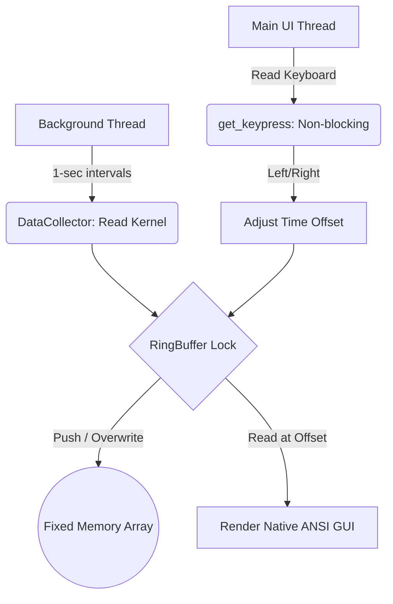

# ⏳ Time-Traveling Task Monitor

> A high-performance, cross-platform OS utility that seamlessly buffers system metric snapshots into a memory-safe `$O(1)$` data structure, allowing you to instantly "rewind time" to analyze historic performance spikes.

## ⚠️ The Problem
Standard operating system utilities like Windows Task Manager, Linux `top`, and `htop` are fundamentally flawed in diagnosing sudden, intermittent system spikes. 
- Because they only display **real-time** states, if your computer experiences a massive 100% CPU freeze that lasts only 2 seconds, by the time you open the Task Manager to see what caused it, the offending process has already returned to normal or crashed out. 
- You are left with no actionable data unless you intentionally log gigabytes of performance traces over hours to review later.

## 🚀 Our Solution
The **Time-Traveling Task Monitor** completely eliminates this blind spot. 
If a system spike occurs while you are occupied, you simply press the **Left Arrow Key** on your keyboard to instantly "rewind time" and observe exactly which process caused the spike, exactly when it happened.
- **What it solves:** It turns a fleeting, unobservable software anomaly into auditable, frozen historical intel without costing you any system performance.

---

## 🏗️ Architecture Breakdown

This application runs on four concurrent architectural pillars specifically optimized for strict resource-constrained machines (e.g., older processors with limited RAM).

### 1. The Data Collector (OS Metrics)
At the heart of the application is the `DataCollector` class. 
- It uses the cross-platform `psutil` library to securely interface with the operating system's kernel data.
- During every tick, it requests the global CPU percentage, global RAM usage, and then iterates through every active process ID (PID) currently running on your machine.
- It computationally tracks CPU deltas and bundles only the top 20 consuming processes into a `SystemSnapshot`.

### 2. The $O(1)$ Ring Buffer (Memory Safety)
To prevent the history recorder from consuming all available RAM over time, we implemented a custom **Fixed-Size Ring Buffer**.
- Unlike standard arrays that grow indefinitely, our `RingBuffer` is pre-allocated with a static size at launch (`[None] * 600`).
- When the buffer hits 600 snapshots (10 minutes of history), a pointer wraps back to index `0` and overwrites the absolute oldest snapshot.
- **Why it matters:** This guarantees the application operates in `$O(1)$` Static Memory. It uses the exact same amount of minuscule RAM at hour 10 as it did at second 1.

### 3. The Concurrency Engine (Background Thread)
To ensure the GUI doesn't freeze while fetching statistics for hundreds of active PIDs, logic is decoupled using true concurrency.
- A background `daemon` thread constantly operates a precision 1Hz sleep-timer.
- It triggers the `DataCollector` and pushes the data to the `RingBuffer`.
- It uses a `threading.Lock()` (Mutex) so that if the user pushes an arrow key to read history at the exact microsecond the background thread is saving new data, the render does not corrupt.

### 4. The Time-Machine Interface (Native GUI)
The main execution thread is completely dedicated to rendering the Terminal UI and listening for keystrokes asynchronously.
- **Cross-Platform Mapping:** A custom `get_keypress()` intercept detects whether you are on Windows (`msvcrt`) or Linux (`termios` & `select`) and translates raw hexadecimal/ANSI bytes of Arrow Keys into logical commands instantly. 
- **Time Offset Navigation:** Pressing the Left Arrow moves the RingBuffer read-head backwards, instructing the UI to visually rewind the render states.
- **Zero-Flicker Engineering:** Instead of clearing the entire screen and causing a visual blinking effect, the UI prints standard ANSI cursor resets (`\033[H`) to seamlessly paint new values directly over old characters like a canvas.

## 📊 System Diagram



## 🛠️ Installation & Setup

You can run this project locally on Windows, MacOS, or Linux. It requires zero heavy installations or C++ compilers.

### Prerequisites
- Python 3.6+
- [psutil](https://pypi.org/project/psutil/) library

### Running the App
1. Clone this repository to your local machine.
2. Install the lightweight dependency:
   ```bash
   pip install psutil
   ```
3. Run the application:
   ```bash
   python app.py
   ```
   *(If you are on Windows, you can simply double-click the `run.bat` file!)*

### Controls
Inside the terminal, use the following keys without hitting Enter:
- `<-` **Left Arrow**: Rewind Time
- `->` **Right Arrow**: Forward Time
- `Spacebar`: Jump instantly back to Live View
- `Q`: Quit application
